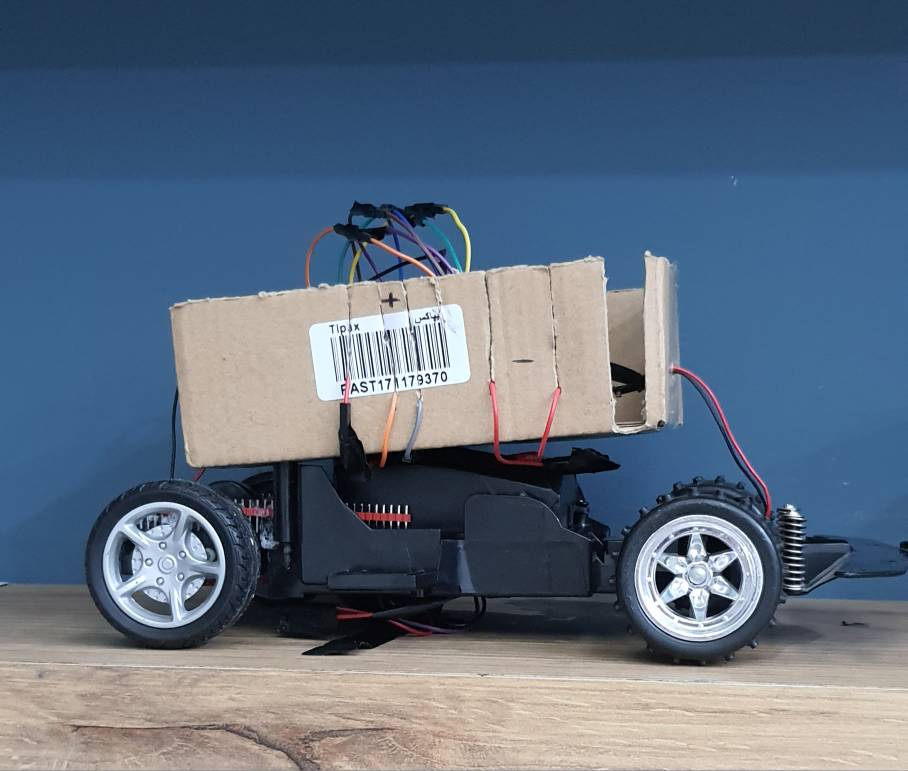
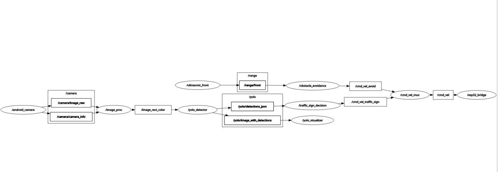
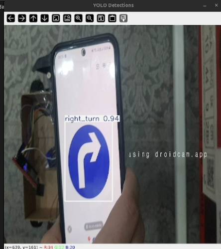

# SmartBot ROS2 (YOLO + ESP32) — خودروی خودران آموزشی



> این پروژه را به‌عنوان یک نمونه‌ی آموزشی/دانشگاهی برای پیاده‌سازی «خودروی خودران مبتنی بر ROS2» توسعه داده‌ام. در این سامانه، جریان تصویر از دوربین موبایل وارد ROS2 می‌شود، با YOLO پردازش می‌گردد و خروجی آن به فرمان‌های کنترلی ساده تبدیل شده و از طریق UDP برای ESP32 ارسال می‌شود تا در نهایت موتورهای خودرو کنترل شوند.

**فارسی** | [English](#english)

## فارسی

### در یک نگاه
- ورودی تصویر از موبایل (DroidCam) و پردازش در ROS2
- تشخیص علائم با **YOLOv8** و خروجی به‌صورت JSON
- ارسال فرمان‌ها با **UDP/IPv4** به ESP32 و کنترل موتور از طریق **TB6612FNG**
- ورودی YOLO در این پروژه روی **640×640** تنظیم شده تا توازن سرعت/دقت حفظ شود

### شرح عملکرد سامانه
جریان کلی به این صورت است:

1) تصویر از دوربین موبایل وارد ROS2 می‌شود (با DroidCam)  
2) تصویر برای YOLO پیش‌پردازش می‌شود (640×640 + letterbox)  
3) YOLO خروجی تشخیص‌ها را تولید می‌کند (به‌صورت JSON)  
4) فقط کلاس‌های `left_turn` / `right_turn` / `stop` به فرمان‌های `LEFT` / `RIGHT` / `STOP` تبدیل می‌شوند  
5) فرمان‌ها از طریق UDP به ESP32 ارسال می‌شوند و ESP32 منطق کنترل موتور را اجرا می‌کند

### مسیر فرمان تا موتور (Control Chain)
برای اینکه دقیق و قابل ارائه باشد، مسیر کنترل به‌صورت زیر است:

- **ROS2 → ESP32**: خروجی نود `cmd_vel_mux` روی تاپیک `/esp32_cmd` تولید می‌شود. نود `esp32_bridge` این پیام‌ها را به‌صورت **UDP/IPv4** و به شکل **رشته‌های ASCII** (مثل `LEFT`, `RIGHT`, `GO`, `STOP`) به IP/Port تعیین‌شده در `params.yaml` ارسال می‌کند.  
- **ESP32 → درایور موتور**: ESP32 فرمان را دریافت می‌کند و سیگنال‌های `IN1/IN2/PWM` را تولید می‌کند.  
- **درایور → موتور‌ها**: سیگنال‌ها وارد **ماژول TB6612FNG** می‌شوند و در نهایت به دو موتور خروجی می‌دهند (در این پروژه: یک موتور برای حرکت و یک موتور برای فرمان/چرخش).

### درباره خودِ ماشین (سخت‌افزار)
- شاسی خودرو با ترکیب قطعات **دو ماشین کنترلی اسباب‌بازی** ساخته شده و به‌عنوان پلتفرم مکانیکی پروژه استفاده شده است.
- برد کنترل: **ESP32-S3-CAM (ESP32-S3-N16R8) با دوربین OV5640**.  
  در این نسخه برای کیفیت بهتر تصویر و ساده‌تر شدن مسیر بینایی، از **دوربین موبایل نصب‌شده روی خودرو** و استریم DroidCam استفاده شده است (نه دوربین OV5640 روی برد).
- تغذیه: در وضعیت فعلی از **باتری کتابی ۹ ولت** به‌همراه **کاهنده‌ی ۹ به ۵ ولت** استفاده کرده‌ام.

### درایور موتور TB6612FNG (خلاصه‌ی Pinout)
ماژول درایور موتور دوکاناله TB6612FNG (یا TB6612FNG روی بردهای آماده) معمولاً این پایه‌ها را دارد:

- `VM`: ولتاژ موتور
- `VCC`: ولتاژ تغذیه بخش منطقی ماژول
- `GND`: زمین (معمولاً چند پایه‌ی GND دارد که به هم متصل‌اند)
- `A1`, `A2`: خروجی‌های موتور کانال A
- `B1`, `B2`: خروجی‌های موتور کانال B
- `PWMA`, `PWMB`: سیگنال کنترل سرعت برای موتورهای A و B (PWM)
- `AIN1`, `AIN2`: سیگنال‌های کنترلی جهت/حالت برای موتور A
- `BIN1`, `BIN2`: سیگنال‌های کنترلی جهت/حالت برای موتور B
- `STBY`: برای فعال بودن درایور باید این پایه `HIGH` باشد (خروج از حالت Standby)

> نکته: بسته به ترکیب سیگنال‌های کنترلی (`AIN1/AIN2` و `BIN1/BIN2`) حالت موتور (چرخش/ترمز/آزاد) تغییر می‌کند. در این پروژه، تولید این سیگنال‌ها داخل فریمور ESP32 انجام می‌شود.

### فناوری‌ها و ابزارهای استفاده‌شده
- ROS2 (نودها با `rclpy`)
- OpenCV + `cv_bridge` برای کار با تصویر
- `ultralytics` (YOLOv8)
- ESP32 (دریافت فرمان با UDP و کنترل موتور)
- دوربین: گوشی Android با DroidCam (استریم روی HTTP)

### پیش‌نیازها (خلاصه)
- Ubuntu + ROS2 (این پروژه عمدتاً با **Jazzy** توسعه و تست شده است)
- Python و پکیج‌های لازم (`opencv`, `ultralytics`, `pyserial`, …)
- گوشی Android + DroidCam (یا هر منبع تصویری که URL بده)
- ESP32 روی همان شبکه (یا در حالت Access Point) و پورت UDP فعال

### نودها (Nodes)
این‌ها نودهای اصلی داخل پکیج `smart_bot_ros2` هستند:

- `android_camera`: دریافت تصویر از DroidCam و انتشار روی `/camera/image_raw`
- `image_proc`: پیش‌پردازش تصویر برای YOLO و انتشار روی `/image_rect_color`
- `yolo_detector`: اجرای YOLOv8 و خروجی روی:
  - `/yolo/detections_json` (لیست تشخیص‌ها به صورت JSON)
  - `/yolo/image_with_detections` (تصویر با باکس‌ها)
- `cmd_vel_mux`: تبدیل تشخیص‌ها به فرمان‌های ساده و انتشار روی `/esp32_cmd`
- `esp32_bridge`: ارسال `/esp32_cmd` به ESP32 با UDP (پورت پیش‌فرض: `8889`)
- `manual_control`: کنترل دستی (حالت UI و حالت تایپی)
- `ultrasonic_front`: سنسور جلو (سه حالت: `sim` / `serial` / `udp`) و انتشار روی `/range/front`
- `obstacle_avoidance`: بر اساس `/range/front` یک خروجی `Twist` روی `/cmd_vel_avoid` منتشر می‌کند (برای توسعه‌های بعدی)
- `yolo_visualizer`: نمایش `/yolo/image_with_detections` با OpenCV

### معماری (نمای کلی)
به‌صورت خلاصه:

```
DroidCam -> /camera/image_raw
          -> image_proc -> /image_rect_color
          -> yolo_detector -> /yolo/detections_json -> cmd_vel_mux -> /esp32_cmd -> esp32_bridge -> UDP -> ESP32
                           -> /yolo/image_with_detections -> yolo_visualizer
```

تصویر زیر یک نمونه از گراف نودها/تاپیک‌ها (خروجی `rqt_graph`) پس از اجرای پروژه است:



### مدل YOLO (YOLOv8)
در این پروژه از YOLOv8 (کتابخانه‌ی `ultralytics`) استفاده شده است. مدل نهایی با داده‌های اختصاصی پروژه در Google Colab آموزش داده شده و خروجی آن در مسیر زیر قرار دارد:

- وزن‌ها (Weights): `smart_bot_ros2/smart_bot_ros2/runs/train/best/best.pt`
- کلاس‌های مورد استفاده در تصمیم‌گیری: `left_turn` / `right_turn` / `stop`

برای اجرای real-time، تصویر ورودی به مدل در ابعاد **640×640** و با روش **letterbox** آماده می‌شود (حفظ نسبت تصویر و جلوگیری از کشیدگی). در تست‌های عملی این پروژه، مدل برای سناریوهای تعریف‌شده‌ی پروژه دقت و پایداری مناسبی داشته و در حین حرکت خودرو نیز قابل استفاده بوده است.

نمونه‌ی خروجی YOLO (تصویر با bounding box) در تصویر زیر آمده است:



### ویدیوی دمو (عملکرد خودرو)
این ویدیو برای نمایش عملکرد خودرو در اجرای واقعی پروژه است:

[مشاهده ویدیو](assets/videos/car_run.mp4)

### مسیرهای مهم در پروژه
- تنظیمات: `smart_bot_ros2/smart_bot_ros2/config/params.yaml`
- لانچ اصلی: `smart_bot_ros2/smart_bot_ros2/launch/smart_bot_launch.py`
- فریمور ESP32: `smart_bot_ros2/smart_bot_ros2/firmware/ESP32_FIRMWARE_FINAL.ino`
- وزن مدل YOLO: `smart_bot_ros2/smart_bot_ros2/runs/train/best/best.pt`

### اجرا (Run)
برای دستورهای build و اجرا، به این فایل مراجعه کنید:
- `docs/RUN.md`

### پیش از اجرا (چک‌لیست)
پیش از اجرا، موارد زیر را بررسی می‌کنم تا از خطاهای رایج جلوگیری شود:

- در `params.yaml` آدرس DroidCam درست تنظیم شده است؟ (`camera_url`)
- مسیر مدل YOLO صحیح و قابل دسترس است؟ (`yolo_detector.model`)
- IP/Port مربوط به ESP32 درست است؟ (`esp32_bridge.udp_ip` و `esp32_bridge.esp32_port`)
- ESP32 به Wi‑Fi متصل است و روی پورت `8889` در حال دریافت UDP است؟

### اگر هدف فقط تست/ارائه‌ی YOLO باشد (بدون خودرو)
برای تست مسیر بینایی، اتصال ESP32 الزامی نیست. این خروجی‌ها برای نمایش کافی هستند:

- پنجره‌ی `yolo_visualizer` (تصویر با باکس‌ها)
- `ros2 topic echo /yolo/detections_json` (خروجی JSON)

### تنظیمات مهم (Params)
پارامترهای اصلی از `params.yaml` خوانده می‌شوند. مواردی که معمولاً نیاز به تنظیم دارند:

- `android_camera.ros__parameters.camera_url` : آدرس DroidCam (IP گوشی + پورت)
- `yolo_detector.ros__parameters.model` : مسیر فایل مدل (`best.pt`)
- `esp32_bridge.ros__parameters.udp_ip` و `esp32_port` : IP و پورت ESP32
- `ultrasonic_front.ros__parameters.mode` : `sim` یا `serial` یا `udp`

### تاپیک‌های کلیدی
- تصویر خام: `/camera/image_raw`
- تصویر آماده برای YOLO: `/image_rect_color`
- خروجی YOLO (JSON): `/yolo/detections_json`
- تصویر با باکس‌ها: `/yolo/image_with_detections`
- فرمان خروجی برای ESP32: `/esp32_cmd`
- فاصله سنسور جلو: `/range/front`

### نکته درباره حرکت رو به جلو
در نسخه‌ی فعلی، تصمیم‌گیری بر اساس YOLO صرفاً روی **چپ/راست/ایست** متمرکز است. برای شروع حرکت رو به جلو، معمولاً ابتدا یک‌بار با `manual_control` فرمان `GO` ارسال می‌شود و سپس فرمان‌های `LEFT/RIGHT/STOP` توسط YOLO تولید و ارسال می‌گردند.

### نکات تکمیلی
- در `smart_bot_launch.py` برای YOLO یک venv با مسیر ثابت در نظر گرفته شده است (`/home/reza/smart_bot_ros2/yolo_env`). اگر مسیر شما متفاوت است، یا همان مسیر را ایجاد کنید، یا مسیر venv/نصب YOLO را با سیستم خود هماهنگ کنید.
- در نسخه‌ی فعلی، `obstacle_avoidance` صرفاً خروجی `/cmd_vel_avoid` تولید می‌کند. برای اثرگذاری روی حرکت خودرو، لازم است یک مرحله‌ی «تبدیل/ادغام» اضافه شود تا `Twist` به فرمان‌های ESP32 تبدیل گردد (در این نسخه متصل نشده است).

---

## English

### What this project does
This is my small ROS2 autonomous-car project:

- Grab video from an Android phone (DroidCam) and publish it into ROS2
- Preprocess frames to 640×640 for YOLO
- Run YOLOv8 and publish detections as JSON
- Convert only `left_turn` / `right_turn` / `stop` into simple commands (`LEFT` / `RIGHT` / `STOP`)
- Send commands to an ESP32 over UDP to drive the motors

### Control chain (UDP → ESP32 → driver → motors)
- `cmd_vel_mux` publishes commands on `/esp32_cmd` (simple strings).
- `esp32_bridge` sends those commands over **UDP/IPv4** as **ASCII strings** (e.g., `LEFT`, `RIGHT`, `GO`, `STOP`) to the ESP32 IP/port set in `params.yaml`.
- ESP32 firmware generates `IN1/IN2/PWM` signals.
- The signals go to a **TB6612FNG** dual motor driver module, then to the motors (in my build: one drive motor + one steering motor).

### Hardware notes
- The chassis is built by combining parts from **two toy RC cars**.
- Controller board: **ESP32-S3-CAM (ESP32-S3-N16R8) with OV5640 camera**.  
  In this version, for better image quality, I use an **Android phone camera** on the car (DroidCam stream) instead of the OV5640.
- Power (current setup): a **9V battery** + a **9V→5V buck converter**.

### TB6612FNG (pinout summary)
- `VM` motor supply, `VCC` logic supply, `GND`
- `A1/A2` motor A outputs, `B1/B2` motor B outputs
- `PWMA/PWMB` speed (PWM), `AIN1/AIN2` control for A, `BIN1/BIN2` control for B
- `STBY` must be `HIGH` to enable the driver

### What I used
- ROS2 (`rclpy`)
- OpenCV + `cv_bridge`
- `ultralytics` (YOLOv8)
- ESP32 over UDP
- Android phone camera via DroidCam (HTTP stream)

### Key locations
- Params: `smart_bot_ros2/smart_bot_ros2/config/params.yaml`
- Launch file: `smart_bot_ros2/smart_bot_ros2/launch/smart_bot_launch.py`
- ESP32 firmware: `smart_bot_ros2/smart_bot_ros2/firmware/ESP32_FIRMWARE_FINAL.ino`
- YOLO weights: `smart_bot_ros2/smart_bot_ros2/runs/train/best/best.pt`

### How to run
See `docs/RUN.md`.

### Notes
- Update the DroidCam URL, YOLO model path, and ESP32 IP/port in `params.yaml` before running.
- For forward motion, I usually send a `GO` command once using `manual_control`, then YOLO handles `LEFT/RIGHT/STOP`.

### If you only want to demo YOLO (no car/ESP32)
You can still run the vision pipeline and show:

- the `yolo_visualizer` window (boxes on the image)
- `ros2 topic echo /yolo/detections_json`

### Media
See `assets/README.md` (files: `assets/images/car.jpg`, `assets/images/rqt_graph.jpg`, `assets/images/yolo_output.jpg`, `assets/videos/car_run.mp4`).
